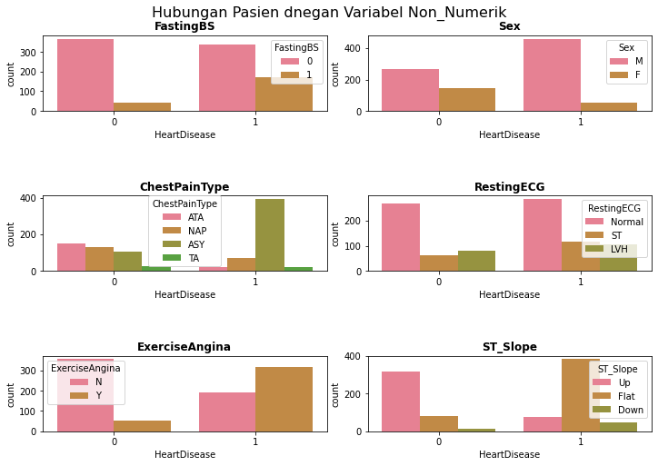
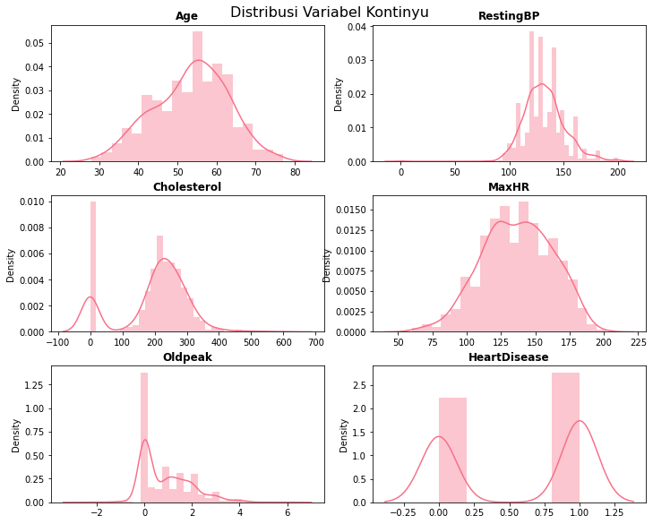
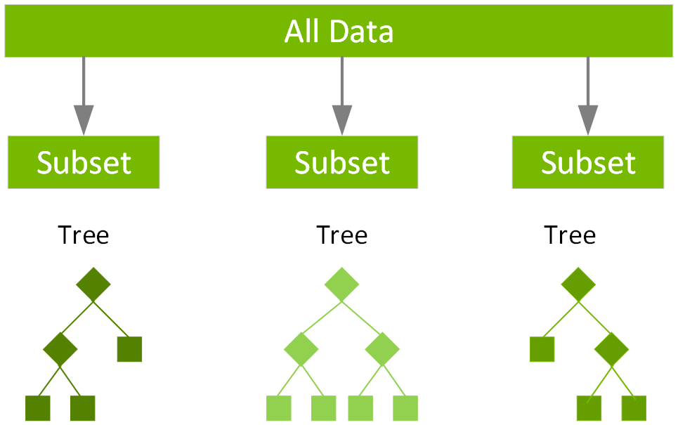
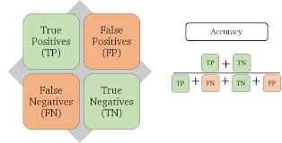

# Laporan Deteksi Kardiovaskuler dengan menggunakan Algoritma XGBoost

## Domain Proyek

Penyakit jantung atau kardiovaskuler merupakan penyakit yang berkaitan jantung dan pembuluh darah [[1]](#1). Berbagai contoh penyakit tersebut misalnya angina,infrak miokard,stroke,gagal jantung,hipertensi,rematik jantung,kardiomyopati,detak jantung abnormal,penyakit jantung bawaan,penyakit pembuluh jantung,karditis,aneurisma aorta,arteri perifer,tromboemboli, dan vena thrombosis [[1]](#1).Penyakit ini merupakan penyakit yang sangat mematikan hingga merenggut 17.9 juta jiwa pada tahun 2015 dari 12.3 juta jiwa pada tahun 1990 [[2]](#2). 

Namun,ternyata 90% dari penyakit jantung dapat dicegah [[3]](#3). Pencegahan tersebut dapat berupa perbaikan pola makan, olahraga, pola hidup sehat tanpa rokok dan alkohol [[1]](#1). Laporan ini berfokus kepada pasien mana yang berkemungkinan terkena penyakit jantung. Untuk itu, dibuatlah sebuah model untuk memprediksi terjadinya penyakit jantung dan berharap dapat memberikan pencegahan awal. 

Untuk membuat model tersebut, terdapat sebuah dataset yang dipublikasikan oleh kaggle.com yang dapat membantu untuk melakukan pelatihan pada model. Dataset tersebut memiliki 12 variabel dengan 918 observasi dimana 508 observasi positif memiliki penyakit jantung dan 410 sebaliknya.Lalu, data tersebut akan dimasukkan ke dalam model XGBoost dimana model tersebut merupakan turunan dari model *tree* yang dapat diskalakan. dan sering digunakan untuk mencapai hasil yang optimal dengan cara *tuning hyperparameter*. Pada laporan ini, digunakan *baseline* model untuk melihat performa awal dari model XGBoost tersebut yang lalu akan dilakukan *hyperparameter tuning* untuk mengoptimalkan model tersebut. Performa tersebut diukur dengan metrik evaluasi akurasi dan skor AUC. Nantinya, model yang telah di-*tuning* tersebut diharapkan mampu memprediksi pasien mana yang berkemungkinan terkena penyakit jantung dengan baik.

  

  
## Business Understanding
    

### Problem Statements

- Apakah penggunaan XGBoost dengan *hyperparameter tuning* dalam membangun model klasifikasi untuk melakukan observasi penyakit jantung dapat memberikan hasil yang optimal?
    
### Goals

- Membuat model klasifikasi menggunakan XGBoost dengan *hyperparameter tuning* agar dapat melakukan klasifikasi observasi penyakit jantung secara optimal.

### Solution statements
- Untuk mencari model XGBoost dengan parameter yang tepat kami menggunakan GridSearchCV untuk mencari hyperparameter yang tepat dengan cara mencari satu persatu atau *bruteforce* mencoba semua kemungkinan untuk mendapatkan model yang paling optimal. Untuk metrik evaluasi yang saya pakai yaitu ROC/AUC dan Akurasi

## Data Understanding
Dataset yang saya pakai untuk membuat model tersebut bernama Heart Failure Prediction Dataset yang berisi 918 observasi pasien tanpa ada *missing values* yang memiliki penyakit jantung dan yang tidak memilikinya berdasarkan variabel yang diberikan. Sumber Dataset: [Kaggle Dataset](https://www.kaggle.com/datasets/fedesoriano/heart-failure-prediction).

### Variabel-variabel pada Heart Failure Prediction dataset adalah sebagai berikut:
- Age: Umur dari pasien [tahun]
- Sex: Jenis kelamin dari pasien [M: Male, F: Female]
- ChestPainType: Jenis penyakit dada [TA: Typical Angina, ATA: Atypical Angina, NAP: Non-Anginal Pain, ASY: Asymptomatic]
- RestingBP: resting blood pressure (tekanan darah saat diam) [mm Hg]
- Cholesterol: serum cholesterol (serum kolesterol) [mm/dl]
- FastingBS: fasting blood sugar (gula darah saat puasa) [1: if FastingBS > 120 mg/dl, 0: otherwise]
- RestingECG: resting electrocardiogram results (hasil elektrokardiogram saat diam) [Normal: Normal, ST: having ST-T wave abnormality (T wave inversions and/or ST elevation or depression of > 0.05 mV), LVH: showing probable or definite left ventricular hypertrophy by Estes' criteria]
- MaxHR: maximum heart rate achieved (detak jantung maksimal)[Numeric value between 60 and 202]
- ExerciseAngina: exercise-induced angina (olahraga) [Y: Yes, N: No]
- Oldpeak: oldpeak = ST (Tingkat Depresi)[Numeric value measured in depression]
- ST_Slope: the slope of the peak exercise ST segment (gradien) [Up: upsloping, Flat: flat, Down: downsloping]
- HeartDisease: output class (label) [1: heart disease, 0: Normal]

**Informasi general mengenai Dataset**

| Nama            | Jumlah       | Tipe Data |
|-----------------|--------------|-----------|
| Age             | 918 non-null | int64     |
| Sex             | 918 non-null | object    |
| ChestPainType   | 918 non-null | object    |
| RestingBP       | 918 non-null | int64     |
| Cholesterol     | 918 non-null | int64     |
| FastingBS       | 918 non-null | int64     |
| RestingECG      | 918 non-null | object    |
| MaxHR           | 918 non-null | int64     |
| ExcerciseAngina | 918 non-null | object    |
| Oldpeak         | 918 non-null | float64   |
| ST_Slope        | 918 non-null | object    |
| HeartDisease    | 918 non-null | int64     |

| | 
|:--:| 
| *Tabel 1. Informasi Tipe data dan Jumlah observasi* |

&nbsp;

|       | Age       | RestingBP  | Cholesterol | FastingBS | MaxHR      | Oldpeak  | HeartDisease |
|-------|-----------|------------|-------------|-----------|------------|----------|--------------|
| count | 918       | 918        | 918         | 918       | 918        | 918      | 918          |
| mean  | 53.510893 | 132.396514 | 198.799564  | 0.233115  | 136.809368 | 0.887364 | 0.553377     |
| std   | 9.4322617 | 18.514154  | 109.384145  | 0.423046  | 25.460334  | 1.066570 | 0.497414     |
| min   | 28        | 0          | 0           | 0         | 60         | -2.6     | 0            |
| 25%   | 47        | 120        | 173.25      | 0         | 120        | 0        | 0            |
| 50%   | 54        | 130        | 223         | 0         | 138        | 0.6      | 1            |
| 75%   | 60        | 140        | 267         | 0         | 156        | 1.5      | 1            |
| max   | 77        | 200        | 603         | 1         | 202        | 6.2      | 1            |

| | 
|:--:| 
| *Tabel 2. Informasi Statistik dasar data* |

**Perbandingan Jumlah Target**

Histogram Target

|  | 
|:--:| 
| *Gambar 1. Histogram target* |    

Pie Chart Target

| | 
|:--:| 
| *Gambar 2. Pie Chart persentase target* |  

Dapat dilihat bahwa perbandingan kelas positif dan negatif pada dataset tidaklah berbeda jauh atau tidak *imbalanced* yaitu dengan persentase positif sebersar 55.3% dan negatif sebesar 44.7% . 

**Distribusi Data Non-Numerik vs Label menggunakan histogram**

| | 
|:--:| 
| *Gambar 3. Histogram distribusi data non-numerik* |

Dari gambar tersebut dapat dilihat bahwa

- FastingBS = FastingBS (1) memiliki tingkat positif yang cukup tinggi daripada tingkat negatif pada label dan jumlah FastingBS(0) lebih banyak daripada FastingBS(1)
 
- Sex = Sex(M) cenderung memiliki tingkat positif yang tinggi dan jumlah Sex(M) lebih banyak daripada Sex(F)

- ChestPainType = ChestPainType (ASY) cenderung memiliki tingkat positif yang tinggi

- RestingECG = RestingECG(Normal) memiliki nilai yang cukup tinggi daripada yang lain

- ExerciseAngina = ExerciseAngina(N) memiliki tingkat negatif yang tinggi sedangkan ExerciseAngina(Y) memiliki tingkat positif yang tinggi

- ST_Slope = ST_Slope(Up) memiliki tingkat negatif yang tinggi sedangkan ST_Slope(Flat) memiliki tingkat positif yang tinggi

**Distribusi Data Numerik menggunakan plot distribusi**

| | 
|:--:| 
| *Gambar 4. Distribusi data numerik* |

Dari gambar tersebut dapat dilihat bahwa

- Age = Distribusi tersebut mendekati distribusi normal

- RestingBP = Terdapat beberapa kejanggalan seperti terdapat observasi yang memiliki nilai 0 yang seharusnya tidak mungkin karena tidak ada tekanan darah saat diam yang bernilai 0

- Cholesterol = Terdapat beberapa kejanggalan seperti terdapat observasi yang memiliki nilai 0 dan negatif yang tidak mungkin

- MaxHR = Distribusi tersebut mendekati distribusi normal

- Oldpeak = Terdapat beberapa kejanggalan seperti terdapat observasi yang memiliki nilai dibawah 0 yang tidak mungkin

- HeartDisease = Merupakan variabel target

**Kesimpulan**

Berdasarkan analisis variabel numerik dan non-numerik,dapat disimpulkan:

Dapat dilihat dari grafik bahwa selain variabel RestingECG, semua variabel non-numerik lainnya memiliki pengaruh terhadap label

Dari grafik variabel-variabel tersebut, hampir semuanya bersifat terdistribusi, namun terdapat beberapa kejanggalan, seperti nilai Cholesterol yang 0 hingga negatif, nilai RestingBP yang bernilai 0, dan Oldpeak yang bernilai negatif. Untuk kejanggalan tersebut akan ditangani nanti

## Data Preparation

**- Mengganti nilai pada variabel non-numerik**
    Hal ini bertujuan untuk mengubah nilai variabel non-numerik menjadi angka. Variabel yang diubah adalah seluruh variabel yang memiliki tipe data object

| ST_Slope  (Text)            | ST_Slope  (Numerical)  |
|-------------                |-------------|
| Up                          | 0  |
| Flat                        | 1   |
| Down                        | 2   |

| | 
|:--:| 
| *Tabel 3. Perubahan nilai text menjadi numerik* |

&nbsp;

**- Melakukan *chi-square test* untuk memilih fitur mana saja yang tidak diperlukan.**
    *chi-square test* merupakan test untuk menentukan apakah variabel kategori a dan variabel kategori b independen atau dependen. *Chi-square test* dirumuskan sebagai berikut :

$$X^{2} = \frac{Observed-Expected}{Expected^{2}}$$

Dimana *Observed* berarti jumlah observasi dari kelas sedangkan *Expected* berarti jumlah observasi dari kelas jika tidak ada hubungan antara variabel fitur dan target. Setelah mendapat semua nilainya, nantinya nilai tersebut akan diranking untuk melihat variabel mana yang paling penting. Terdapat library pada python yang mampu melakukan perhitungan tersebut yaitu chi2 pada sklearn.feature_selection. Dengan menggunakan fungsi tersebut, telah didapatkan hasil sebagai berikut:

|Rank              |   Name              | Chi Squared Score |
|------------------|----------------|-------------------|
|1| ChestPainType  | 160.736878        |
|2| ExerciseAngina | 133.640134        |
|3|ST_Slope       | 77.486680         |
|4|FastingBP      | 50.296983         |
|5|Sex            | 18.006243         |
|6|RestingECG     | 1.218136          |
    
| | 
|:--:| 
| *Tabel 4. Ranking skor chi-square* |
    
**- Melakukan standardisasi untuk variabel numerik**
    Hal ini bertujuan untuk mengubah nilai menjadi rata-ratanya 0 dan standar deviasinya 1. Disini kami menggunakan fungsi dari StandardScaler dalam python dari library sklearn.preprocessing . Standardisasi dilakukan di dalam seluruh fitur yang memiliki tipe data bukan object
    
Sebuah nilai dikatakan telah distandarisasi jika
    

$$x^{'} = \frac{x- \mu}{\sigma}$$

$$\mu = sum(x)/count(x)$$ 
Dimana $\mu$ adalah rata-rata

dan $$\sigma = \sqrt{\frac{x-\mu^{2}}{count(x)}}$$

dimana $\sigma$ adalah standar deviasi

**- Melakukan ANOVA test untuk memilih fitur mana saja yang tidak diperlukan.**
    ANOVA merupakan test untuk melihat apakah variabel numerik a dan variabel kategori b independen atau dependen. Untuk menghitung ANOVA , dapat dilakukan dengan cara berikut:

$$ F = \frac{\sum_{j=1}^{j} N_{j}(\overline{x_{j}}-\overline{x})/(J-1)}{\sum_{j=1}^{j}(N_{j}-1)s_{j}^{2}/(N-1)} $$

Dengan J adalah derajat kebebasan variabel tersebut dan N adalah jumlah sampel. Setelah mendapat semua nilainya, nantinya nilai tersebut akan diranking untuk melihat variabel mana yang paling penting. Terdapat library pada python yang mampu melakukan perhitungan tersebut yaitu f_classif pada sklearn.feature_selection. Dengan menggunakan fungsi tersebut, telah didapatkan hasil sebagai berikut:
 

|Rank|Name | ANOVA Score |
|----|-----|--------------------|
|1| MaxHR       | 112.742869  |
|2| Oldpeak     | 83.232308   |
|3| Age         | 51.715809   |
|4| Cholesterol | 42.679814   |
|5| RestingBP   | 5.489803    |

| | 
|:--:| 
| *Tabel 5. Ranking skor ANOVA* |

**- Seleksi Fitur**
    Hal ini bertujuan untuk memilih fitur mana saja yang akan digunakan dalam model berdasarkan chi-square dan ANOVA score yang telah kita lakukan tadi. Disini kita membuang variabel Cholesterol,RestingBP,Sex,dan RestingECG karena nilainya yang rendah. Untuk membuang variabel yang tidak diperlukan tersebut, dapat menggunakan fungsi dari library pandas yang bernnama drop diikuti dengan argumen kolom yang akan dibuang.
    
**- Melakukan split dataset (train,test)**
    Hal ini bertujuan untuk melakukan pelatihan model dan melihat hasil model . Disini dataset dibagi menjadi train dimana subset tersebut digunakan untuk melakukan pelatihan ,sedangkan test dimana subset tersebut digunakan untuk mengevaluasi hasil model dengan porsi 80:20 . Untuk melakukan hal tersebut, terdapat fungsi di python yang bernama sklearn.model_selection.train_test_split yang berfungsi untuk membagi dataset

## Modeling
Disini kami menggunakan model XGBoostClassifier, sebuah algoritma yang berbasis pohon keputusan yang dapat diskalakan [[4]](#4). XGBoost sendiri terdiri dari dua elemen penting yaitu *Gradient Boosting* dan Pohon Keputusan. Pohon keputusan sendiri merupakan algoritma pembelajaran mesin yang berbentuk seperti pohon dalam visualisasinya karena ia memiliki akar dengan banyak daun dan cabang. Sedangkan *Gradient Boosting* adalah metode dalam pembelajaran mesin yang menggabungkan banyak prediksi dari beberapa model menjadi satu. Sehingga jika digabungkan XGBoost merupakan sebuah algoritma *gradient boosting* yang menggunakan pohon keputusan sebagai prediktor yang "lemah" . Seperti yang ditunjukkan pada Gambar 5, XGBoost bekerja dengan cara membagi subset data lalu masing-masing pada subset hasil pembagian tersebut digunakan untuk melatih prediktor yang "lemah" yang lalu akan digunakan untuk menghasilkan prediksi yang nantinya akan digabungkan untuk melhiat hasil yang terbaik. 

| | 
|:--:| 
| *Gambar 5. Tree Gradient Boosting* |

Hal yang membuat algoritma ini sangat bagus dan mumpuni adalah  *Hyperparameter*-nya. *Hyperparameter* sendiri merupakan parameter-parameter yang terdapat dalam model tersebut yang mana bisa kita atur sendiri agar dapat mencapai hasil yang lebih baik.

Parameter dari XGBoost

| Parameter        | Default         | Deskripsi                                                    |
|------------------|-----------------|--------------------------------------------------------------|
| learning_rate    | 0.3             | mengecilkan weight di setiap iterasi                         |
| n_estimators     | 100             | banyaknya pohon yang digunakan                               |
| objective        | binary logistic | Logistik Regresi untuk klasifikasi biner                     |
| booster          | gbtree          | model untuk tiap iterasi                                     |
| nthread          | max             | jumlah core yang dipakai                                     |
| min_child_weight | 1               | jumlah weight minimum pada tiap anak pohon                   |
| max_depth        | 6               | nilai kedalaman maksimum pada pohon                          |
| gamma            | 0               | nilai reduksi loss minimum untuk proses pemisahan pada pohon |
| subsample        | 1               | mengatur proporsi sample                                     |
| colsample_bytree | 1               | pecahan kolom dari sample acak                               |
| reg_lambda       | 1               | L2 regularisasi dalam weight                                 |
| reg_alpha        | 0               | L1 regularisasi dalam weight                                 |

| | 
|:--:| 
| *Tabel 6. Parameter XGBoost* |

Pada python terdapat sebuah library yang dapat digunakan untuk memakai model tersebut yang bernama xgboost. 

Kelebihan
 - Bagus untuk data yang berukuran sedang dan kecil
 - Memiliki parameter yang banyak sehingga dapat di tune untuk mendapatkan hasil yang lebih baik
 
Kekurangan
 - Sensitif terhadap outliers 
 - Mudah untuk overfit karena memiliki parammeter yang sangat banyak

Untuk melihat hasil baseline model kami menggunakan XGBoost dengan parameter default/tanpa hyperparameter tuning. Setelah itu kami menggunakan GridSearchCV untuk melakukan *bruteforce* kemungkinan parameter terbaik dengan range search.
    
GridSearchCV
    Merupakan sebuah algoritma untuk melakukan *bruteforce* terhadap parameter yang diberikan. Nantinya algoritma ini akan mencari kombinasi parameter terbaik dari seluruh parameter yang diberikan dengan cara mencoba semua kombinasi parameter dan melakukan evaluasi tiap akhir iterasi yang lalu meranking parameter-parameter mana yang menghasilkan hasil terbaik berdasarkan metrik evaluasi yang diberikan. Untuk menggunakan algoritma tersebut, terdapat kelas GridSearchCV pada library sklearn.model_selection yang dapat digunakan. 
    
GridSearchCV parameter

| Parameter        | nilai          |
|------------------|----------------|
| learning_rate    | [0.1,0.3,0.03] |
| n_estimators     | [100,300,500]  |
| min_child_weight | [1,5,10]       |
| gamma            | [0.5,1,2,5]    |
| subsample        | [0.6,0.8,1.0]  |
| colsample_bytree | [0.6,0.8,1.0]  |
| max_depth        | [4,6,8]        |

| | 
|:--:| 
| *Tabel 7. Parameter yang digunakan pada GridSearchCV* |

Hasil dari GridSearchCV yang telah didapat

| Parameter        | nilai |
|------------------|-------|
| learning_rate    | 0.1   |
| n_estimators     | 100   |
| min_child_weight | 1     |
| gamma            | 2     |
| subsample        | 1.0   |
| colsample_bytree | 0.6   |
| max_depth        | 4     |

| | 
|:--:| 
| *Tabel 8. Hasil pencarian GridSearchCV* |

Setelah mendapatkan parameter terbaik dari hasil GridSearchCV tersebut, nantinya parameter-parameter tersebut akan digunakan  dalam model XGBoost yang baru.

## Evaluation

Pada kasus klasifikasi ini kami menggunakan metrik evaluasi berupa akurasi dan roc/auc. Akurasi dan ROC/AUC didapatkan dari matriks konfusi dimana matriks tersebut mencerminkan nilai TruePositive,FalsePositive,TrueNegative,FalseNegative. True Positive merupakan hasil dimana model memprediksi nilai 1 atau benar terdapat penyakit jantung dan subset test juga menunjukkan nilai 1. False Positive merupakan hasil dimana model memprediksi nilai 1 dan subset test menunjukkan nilai 0 atau tidak terdapat penyakit jantung. True Negative merupakan hasil dimana model memprediksi nilai 0 dan subset test menunjukkan nilai 0. False Negative merupakan hasil dimana model memprediksi nilai 0 dan subset test menunjukkan nilai 1.

| | 
|:--:| 
| *Gambar 6. Confusion Matrix* |

Hasil Confusion Matrix Sebelum Tuning

| TP | FP | FN | TN |
|----|----|----|----|
| 63 | 16 | 15 | 90 |

| | 
|:--:| 
| *Tabel 9. Confusion Matrix sebelum tuning* |

Dari hasil tersebut, dapat disimpulkan

- Model memprediksi benar terdapatnya penyakit jantung sebanyak 63 observasi
- Model memprediksi salah terdapatnya penyakit jantung sebanyak 16 observasi
- Model memprediksi salah tidak terdapatnya penyakit jantung sebanyak 15 observasi
- Model memprediksi benar tidak terdapatnya penyakit jantung sebanyak 90 observasi

Hasil Confusion Matrix Setelah Tuning

| TP | FP | FN | TN |
|----|----|----|----|
| 62 | 17 | 14 | 91 |

| | 
|:--:| 
| *Tabel 10. Confusion Matrix setelah tuning* |

Dari hasil tersebut, dapat disimpulkan

- Model memprediksi benar terdapatnya penyakit jantung sebanyak 62 observasi
- Model memprediksi salah terdapatnya penyakit jantung sebanyak 17 observasi
- Model memprediksi salah tidak terdapatnya penyakit jantung sebanyak 14 observasi
- Model memprediksi benar tidak terdapatnya penyakit jantung sebanyak 91 observasi

**Akurasi**

    Metrik Akurasi merupakan metrik yang sering dipakai dalam problem ML. Metrik ini dapat bekerja baik pada kasus ini karena data yang kami miliki memiliki distribusi target yang seimbang/ tidak imbalanced. Akurasi ini bekerja dengan cara menghitung nilai prediksi yang benar oleh model dan membandingkan dengan seluruh hasil prediksi subset data.
    
| | 
|:--:| 
| *Gambar 7. Penjelasan Metrik Akurasi* |

**ROC/AUC**

    Metrik ini merupakan metrik yang menunjukkan seberapa baik model kita dalam membedakan kelas target. Semakin tinggi skor nya, semakin baik model tersebut dalam membedakan kelas target. Garis ROC/AUC diplotkan berdasarkan TPR y-axis(TruePositiveRate) vs FPR x-axis(FalsePositiveRate). ROC atau *Receiver Operator Characteristic* merupakan metrik evaluasi yang menunjukkan bahwa sebuah model dapat membedakan mana 'sinyal' dan mana 'noise' . Sedangkan AUC atau *Area Under Curve* merupakan ringkasan dari ROC yang menunjukkan bahwa seberapa baik model dapat membedakan kelas target. Semakin tinggi nilai AUC menandakan bahwa semakin baik model membedakan kelas positif dan negatif. 
    
$$TPR/Recall/Sensitivity = \frac{TP}{TP+FN}$$

$$Specificity = \frac{TN}{TN+FP}$$

$$FPR = 1- Specificity = \frac{FP}{TN+FP}$$

Kurva ROC/AUC 

| | 
|:--:| 
| *Gambar 8. Penjelasan Kurva ROC/AUC* |

**- Hasil sebelum Tuning**

Dari baseline model, telah di dapatkan hasil model sebagai berikut:

| Jenis Metrik | Nilai    |
|--------------|----------|
| Akurasi      | 0.876    |
| AUC          | 0.949446 |

&nbsp;

| | 
|:--:| 
| *Tabel 11. Hasil sebelum tuning* |

Kurva ROC/AUC

| | 
|:--:| 
| *Gambar 9. Kurva ROC/AUC sebelum tuning* |

Dari hasil diatas, dapat disimpulkan bahwa *baseline* model sebenarnya sudah dapat memprediksi dengan baik karena telah mendapat nilai akurasi yang cukup tinggi dan nilai AUC yang juga tinggi yang mendekati nilai 1 dimana menandakan model dapat membedakan kelas target dengan baik. 

**- Hasil setelah Tuning**

Setelah memasukkan parameter yang telah didapat dari GridSearchCV, hasilnya sebagai berikut:

| Jenis Metrik | Nilai    |
|--------------|----------|
| Akurasi      | 0.8965   |
| AUC          | 0.956729 |

| | 
|:--:| 
| *Tabel 11. Hasil setelah tuning* |

&nbsp;

| | 
|:--:| 
| *Gambar 10. Kurva ROC/AUC setelah tuning* |

Dari hasil diatas, dapat dilihat bahwa model setelah melakukan *tuning* mendapat kemajuan berupa nilai akurasi dan skor AUC yang lebih daripada hasil sebelum *tuning*. Meskipun perubahannya tidak terlalu signifikan karena pada dasarnya model tersebut sudah sangat baik dalam membedakan kelas, tetapi kita melihat sedikit kenaikan pada akurasi dan skor AUC. 

**Kesimpulan**

Setelah kita melakukan hyperparameter tuning, kita berhasil mendapatkan hasil Akurasi dan ROC/AUC yang lebih baik daripada sebelum melakukan tuning. Oleh karena itu kita berhasil mendapatkan model XGBoost dengan hyperparameter tuning yang baik. Hal tersebut dapat kita lihat dari hasil classification matrix kita yang berhasil membedakan True Positive dan True Negative. Disini telah didaptkan model akhir dengan akurasi sebesar 0.8965 dan skor AUC sebesar 0.956729.

## Referensi
<a id="1" href="http://whqlibdoc.who.int/publications/2011/9789241564373_eng.pdf?ua=1">[1]</a> 
Shanthi M, Pekka P, Norrving B (2011). Global Atlas on Cardiovascular Disease Prevention and Control. World Health Organization in collaboration with the World Heart Federation and the World Stroke Organization.

<a id="2" href="https://doi.org/10.1016%2FS0140-6736%2816%2931012-1">[2]</a> 
Wang H, Naghavi M, Allen C, Barber RM, Bhutta ZA, Carter A, et al. (GBD 2015 Mortality and Causes of Death Collaborators) (October 2016). "Global, regional, and national life expectancy, all-cause mortality, and cause-specific mortality for 249 causes of death, 1980-2015: a systematic analysis for the Global Burden of Disease Study 2015". Lancet. 388 (10053): 1459–1544.

<a id="3" href="https://doi.org/10.1161%2FCIRCULATIONAHA.107.717033">[3]</a> 
McGill HC, McMahan CA, Gidding SS (March 2008). "Preventing heart disease in the 21st century: implications of the Pathobiological Determinants of Atherosclerosis in Youth (PDAY) study". Circulation. 117 (9): 1216–27.

<a id="4" href="https://dl.acm.org/doi/abs/10.1145/2939672.2939785">[4]</a> 
Chen, T., Guestrin, C., 2016. XGBoost: A scalable tree boosting system. In: Proc. 22nd ACM SIGKDD Int. Conf. Knowl. Discovery Data Mining, Aug. 2016, pp. 1-2.
